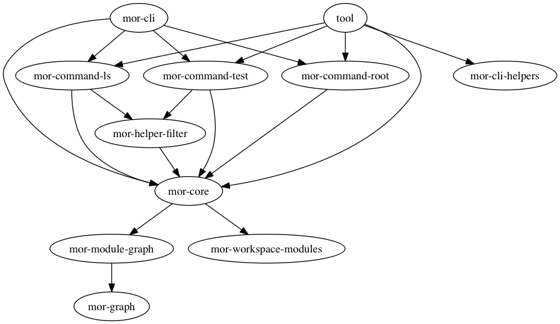

# Monorepo tools

## Screenshot


## Dependencies (generated by mor + graphwiz)


## Folder structure

The future yarn structure described in [issue 3294](https://github.com/yarnpkg/yarn/issues/3294)
```sh
project root
├── package.json <-- root config with 'workspaces' property
├── packages
│   └── foobar
│       ├── node_modules <-- ignored by default
│       │   └── foobar2
│       │       └── package.json
│       └── package.json <-- included
└── readme.md

4 directories, 4 files
```

Or [lerna](https://github.com/lerna/lerna)

```sh
project root
├── lerna.json  <-- lerna!
├── package.json
├── packages
│   └── foobar
│       ├── node_modules <-- ignored by default
│       │   └── foobar2
│       │       └── package.json
│       └── package.json <-- included
└── readme.md

4 directories, 4 files
```

## Compose a custom cli for your monorepo

[example](scripts) usage in this repository

## TODO

### mor-cli
```
mor run
mor run --in-order --reverse install
```
### mor-command-cycles
### mor-command-nsp
> checks packages with nsp

hoisting with yarn f**s this up??

### mor-command-hasdep
```
hasdep [--prod] [--dev] foobar
hasdep [--prod] [--dev] foobar@^2.0
```

### mor-helpers
> Collection of helper functions used by mor commands.

### mor-helper-filter-hasdep
> has external depenendency


## Oppsett i det fri som funker bra med mor

[turf](https://github.com/Turfjs/turf) funker strålende
[conventional-changelog?](https://github.com/conventional-changelog/conventional-changelog) testene brekker for meg
